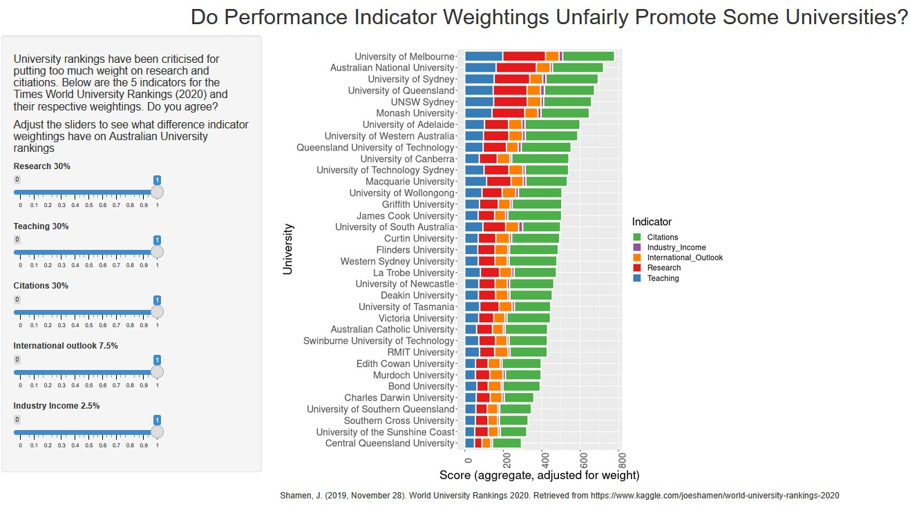

# Australian Universities Ranking Visualization

This interactive visualization was created using **R** to explore and rank universities exclusively from Australia.

https://hulkbogan.shinyapps.io/assignment3/

## Features

- **Interactive sliders** allow users to dynamically adjust the weightings of different criteria.
- Rankings update in real time based on user-selected preferences.
- Focuses solely on Australian universities for a localized and relevant comparison.

## Technologies

- Built with R and interactive visualization tools.

## How to Use

Use the sliders to change the importance (weightings) of different ranking criteria. The rankings will update automatically based on your selections.

---

Feel free to explore the sliders and see how changing the weightings affects the university rankings!
